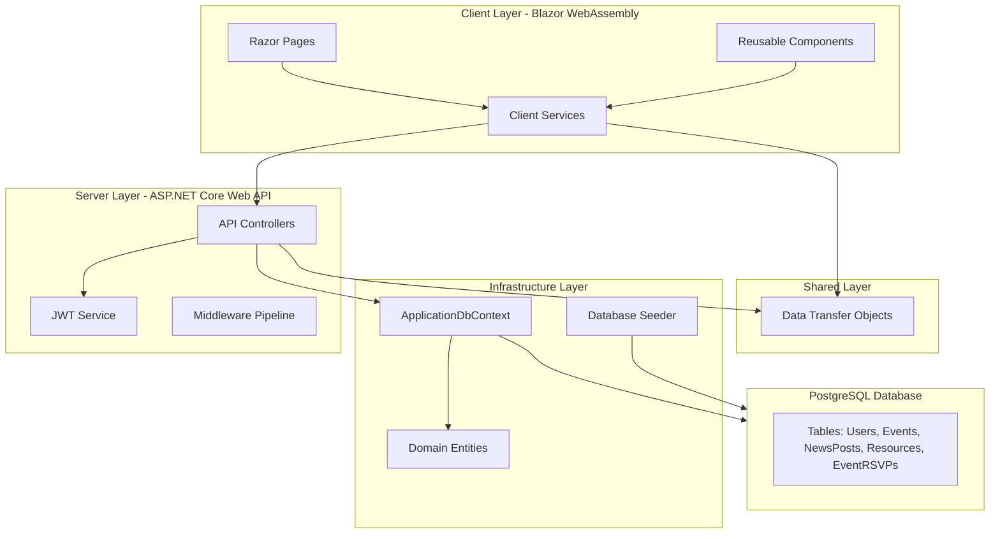
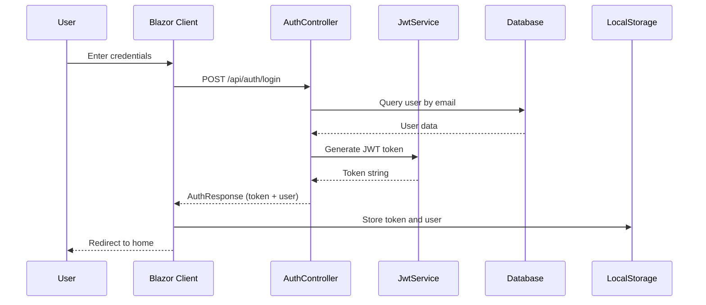
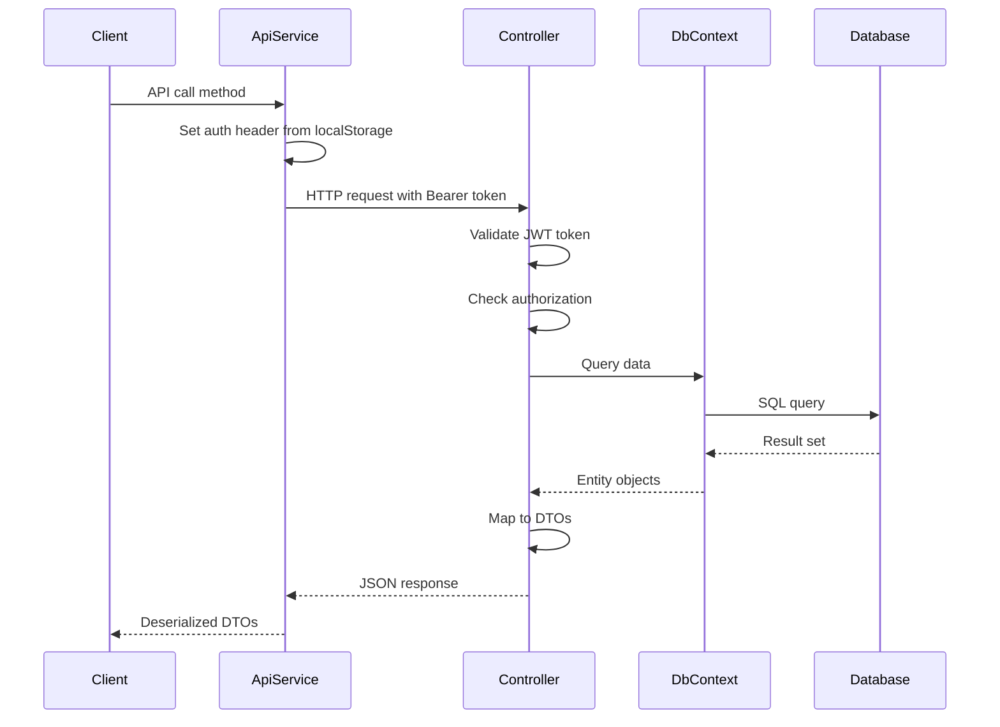
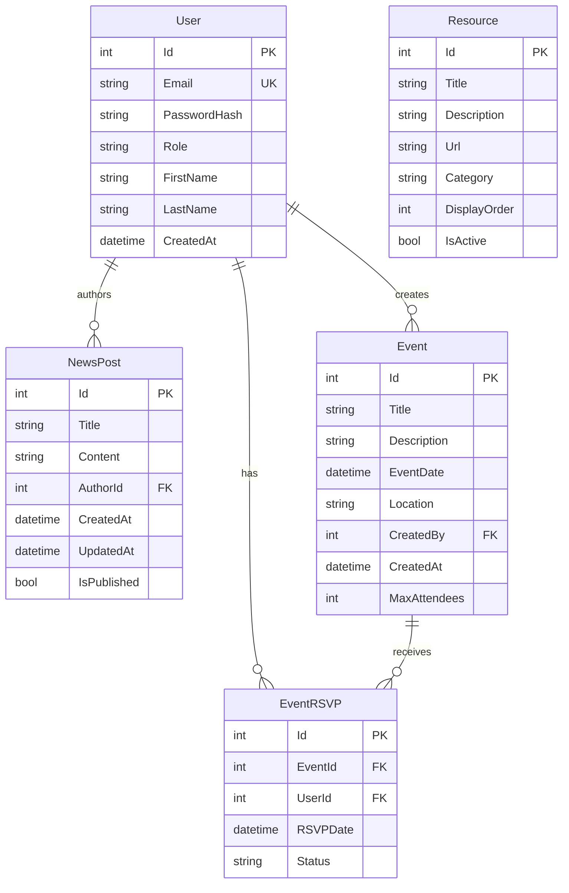

# Campus Connect Hub - Application Documentation

## Table of Contents

1. [Introduction & Overview](#introduction--overview)
2. [Architecture & System Design](#architecture--system-design)
3. [Project Structure](#project-structure)
4. [Database Schema](#database-schema)
5. [API Documentation](#api-documentation)
6. [Authentication & Authorization](#authentication--authorization)
7. [Frontend Architecture](#frontend-architecture)
8. [Backend Architecture](#backend-architecture)
9. [User Guides](#user-guides)
10. [Development Setup](#development-setup)
11. [Code Comments Coverage](#code-comments-coverage)
12. [Configuration](#configuration)
13. [Deployment](#deployment)
14. [Project Board Organization](#project-board-organization)
15. [Troubleshooting](#troubleshooting)

---

## Introduction & Overview

### Project Purpose

Campus Connect Hub is a full-stack .NET 8 application designed to bridge the communication gap between faculty, student organizations, and the student body. The platform centralizes campus updates, enhances student engagement, and provides a single source of truth for campus activities.

### Key Features

- **User Authentication**: Secure JWT-based authentication for Students and Administrators
- **Campus News Feed**: Centralized dashboard displaying announcements from faculty and departments
- **Event Management**: Calendar interface allowing students to view upcoming events and RSVP
- **Resource Directory**: Curated list of quick links to essential campus services
- **Admin Dashboard**: Restricted view for faculty to post news and manage events
- **Modern UI/UX**: Beautiful, responsive design with glassmorphism effects and smooth animations

### Technology Stack

- **Frontend**: Blazor WebAssembly (.NET 8)
- **Backend**: ASP.NET Core Web API (.NET 8)
- **Database**: PostgreSQL with Entity Framework Core (Neon PostgreSQL)
- **Authentication**: JWT (JSON Web Tokens)
- **Hosting**: Microsoft Azure
  - Frontend: Azure Static Web Apps
  - Backend: Azure App Service (Linux)

### Live Application

The application is deployed and accessible at:

**Production URL**: [https://campus-connect-hub-akhrhqcrczggfdgk.canadacentral-01.azurewebsites.net/](https://campus-connect-hub-akhrhqcrczggfdgk.canadacentral-01.azurewebsites.net/)

This is the live production instance hosted on Azure App Service in the Canada Central region.

### High-Level Architecture



---

## Architecture & System Design

### Layered Architecture

The application follows a clean, layered architecture pattern:

#### 1. Client Layer (Blazor WebAssembly)
- **Location**: `CampusConnectHub.Client/`
- **Purpose**: User interface and client-side logic
- **Components**:
  - Razor Pages for routing and views
  - Reusable Razor Components
  - Client-side services for API communication
  - Local storage management for authentication state

#### 2. Server Layer (ASP.NET Core Web API)
- **Location**: `CampusConnectHub.Server/`
- **Purpose**: Business logic, API endpoints, and request handling
- **Components**:
  - RESTful API Controllers
  - JWT authentication service
  - Middleware pipeline configuration
  - CORS policy management

#### 3. Infrastructure Layer
- **Location**: `CampusConnectHub.Infrastructure/`
- **Purpose**: Data access and domain entities
- **Components**:
  - Entity Framework Core DbContext
  - Domain entity models
  - Database seeding logic
  - Entity configurations

#### 4. Shared Layer
- **Location**: `CampusConnectHub.Shared/`
- **Purpose**: Common data structures for API communication
- **Components**:
  - Data Transfer Objects (DTOs)
  - Request/Response models

### Data Flow

#### Authentication Flow



#### Request/Response Flow



### Technology Stack Details

#### .NET 8
- Latest LTS version of .NET
- Improved performance and minimal APIs
- Native AOT support for Blazor WebAssembly
- Enhanced dependency injection

#### PostgreSQL with Entity Framework Core
- Robust relational database
- ACID compliance
- Entity Framework Core for ORM
- Code-first migrations support
- Neon PostgreSQL for cloud hosting

#### JWT Authentication
- Stateless authentication
- Secure token-based authorization
- Role-based access control (RBAC)
- Token expiration and validation

#### Blazor WebAssembly
- Client-side rendering
- C# code running in browser
- Component-based architecture
- SignalR support for real-time features

---

## Project Structure

### Solution Organization

```
Campus Connect Hub/
├── CampusConnectHub.Server/          # ASP.NET Core Web API
│   ├── Controllers/                  # API Controllers
│   │   ├── AdminController.cs        # Admin dashboard endpoints
│   │   ├── AuthController.cs         # Authentication endpoints
│   │   ├── EventsController.cs       # Event management endpoints
│   │   ├── EventRSVPController.cs    # RSVP management endpoints
│   │   ├── NewsController.cs         # News post endpoints
│   │   └── ResourcesController.cs    # Resource management endpoints
│   ├── Services/                     # Business logic services
│   │   └── JwtService.cs             # JWT token generation
│   ├── Program.cs                    # Application entry point and configuration
│   └── appsettings.json              # Application configuration
│
├── CampusConnectHub.Client/          # Blazor WebAssembly
│   ├── Pages/                        # Razor pages (routes)
│   │   ├── Home.razor                # News feed page
│   │   ├── Events.razor               # Events listing page
│   │   ├── Resources.razor           # Resources page
│   │   ├── Login.razor               # Login page
│   │   ├── Register.razor            # Registration page
│   │   └── Admin.razor                # Admin dashboard page
│   ├── Components/                   # Reusable components
│   │   ├── EventManagement.razor     # Event CRUD component
│   │   ├── NewsManagement.razor      # News CRUD component
│   │   └── ResourceManagement.razor  # Resource CRUD component
│   ├── Layout/                       # Layout components
│   │   ├── MainLayout.razor           # Main application layout
│   │   └── NavMenu.razor              # Navigation menu
│   ├── Services/                     # Client-side services
│   │   ├── ApiService.cs             # API communication service
│   │   ├── AuthService.cs            # Authentication service
│   │   ├── LocalStorageService.cs    # Local storage wrapper
│   │   └── ILocalStorageService.cs   # Local storage interface
│   ├── Program.cs                    # Client entry point
│   └── wwwroot/                      # Static files
│       ├── css/                      # Stylesheets
│       └── index.html                # HTML entry point
│
├── CampusConnectHub.Infrastructure/  # Data access layer
│   ├── Data/                         # Database context
│   │   ├── ApplicationDbContext.cs   # EF Core DbContext
│   │   └── DatabaseSeeder.cs         # Initial data seeding
│   └── Entities/                    # Domain entities
│       ├── User.cs                   # User entity
│       ├── Event.cs                  # Event entity
│       ├── EventRSVP.cs             # RSVP entity
│       ├── NewsPost.cs               # News post entity
│       └── Resource.cs               # Resource entity
│
└── CampusConnectHub.Shared/          # Shared DTOs
    └── DTOs/                         # Data Transfer Objects
        ├── AuthResponse.cs           # Authentication response
        ├── LoginRequest.cs           # Login request
        ├── RegisterRequest.cs        # Registration request
        ├── UserResponse.cs           # User data response
        ├── EventDto.cs               # Event data transfer
        ├── CreateEventDto.cs         # Event creation request
        ├── NewsPostDto.cs            # News post data transfer
        ├── CreateNewsPostDto.cs      # News creation request
        ├── ResourceDto.cs           # Resource data transfer
        ├── CreateResourceDto.cs     # Resource creation request
        ├── RSVPDto.cs               # RSVP data transfer
        ├── AdminDashboardDto.cs     # Admin dashboard data
        └── PagedResponse.cs         # Pagination wrapper
```

### File Organization Patterns

#### Controllers
- One controller per domain entity/resource
- RESTful endpoint naming conventions
- Authorization attributes for protected endpoints
- Consistent error handling

#### Services
- Single responsibility principle
- Dependency injection for testability
- Async/await for all I/O operations

#### Entities
- Plain C# classes representing database tables
- Navigation properties for relationships
- Default values for common properties

#### DTOs
- Separate request and response DTOs
- Validation attributes where needed
- No business logic in DTOs

---

## Database Schema

### Entity Relationship Diagram



### Entity Documentation

#### User
- **Purpose**: Stores user account information and authentication data
- **Properties**:
  - `Id`: Primary key, auto-increment
  - `Email`: Unique identifier for login, indexed
  - `PasswordHash`: BCrypt hashed password
  - `Role`: User role ("Student" or "Administrator")
  - `FirstName`: User's first name
  - `LastName`: User's last name
  - `CreatedAt`: Account creation timestamp
- **Relationships**:
  - One-to-many with `NewsPost` (author relationship)
  - One-to-many with `Event` (creator relationship)
  - One-to-many with `EventRSVP` (user RSVPs)

#### NewsPost
- **Purpose**: Campus announcements and news articles
- **Properties**:
  - `Id`: Primary key
  - `Title`: News post title (max 200 characters)
  - `Content`: Full news content
  - `AuthorId`: Foreign key to User (author)
  - `CreatedAt`: Post creation timestamp
  - `UpdatedAt`: Last update timestamp (nullable)
  - `IsPublished`: Publication status flag
- **Relationships**:
  - Many-to-one with `User` (author)

#### Event
- **Purpose**: Campus events and activities
- **Properties**:
  - `Id`: Primary key
  - `Title`: Event title (max 200 characters)
  - `Description`: Event description
  - `EventDate`: Scheduled date and time
  - `Location`: Event location (max 200 characters)
  - `CreatedBy`: Foreign key to User (creator)
  - `CreatedAt`: Event creation timestamp
  - `MaxAttendees`: Maximum capacity (nullable)
- **Relationships**:
  - Many-to-one with `User` (creator)
  - One-to-many with `EventRSVP` (RSVPs)

#### EventRSVP
- **Purpose**: User event registrations
- **Properties**:
  - `Id`: Primary key
  - `EventId`: Foreign key to Event
  - `UserId`: Foreign key to User
  - `RSVPDate`: RSVP submission timestamp
  - `Status`: RSVP status ("Confirmed" or "Cancelled")
- **Relationships**:
  - Many-to-one with `Event`
  - Many-to-one with `User`
- **Constraints**:
  - Unique constraint on (EventId, UserId) combination
  - Cascade delete on Event deletion
  - Cascade delete on User deletion

#### Resource
- **Purpose**: Quick links to campus services and resources
- **Properties**:
  - `Id`: Primary key
  - `Title`: Resource title (max 200 characters)
  - `Description`: Resource description (max 500 characters)
  - `Url`: Resource URL (max 500 characters)
  - `Category`: Resource category (max 100 characters)
  - `DisplayOrder`: Sorting order for display
  - `IsActive`: Active status flag
- **Relationships**: None (standalone entity)

### Database Seeding Strategy

The application uses `DatabaseSeeder` class to populate initial data:

1. **Admin User**: Default administrator account
   - Email: `admin@campus.edu`
   - Password: `Admin123!`
   - Role: Administrator

2. **Student User**: Sample student account
   - Email: `student@campus.edu`
   - Password: `Student123!`
   - Role: Student

3. **Sample News Posts**: 3 pre-created news posts

4. **Sample Events**: 3 pre-created events

5. **Sample Resources**: 5 pre-created resource links

Seeding occurs automatically on first application startup via `EnsureCreated()` in `Program.cs`.

---

## API Documentation

### Base URL

- **Development**: `https://localhost:7126`
- **Production**: `https://campus-connect-hub-akhrhqcrczggfdgk.canadacentral-01.azurewebsites.net`

### Authentication

Most endpoints require JWT authentication. Include the token in the Authorization header:

```
Authorization: Bearer <token>
```

### Endpoints by Controller

#### AuthController

Base Route: `/api/auth`

##### POST /api/auth/login

Authenticate a user and receive a JWT token.

**Request Body:**
```json
{
  "email": "student@campus.edu",
  "password": "Student123!"
}
```

**Response (200 OK):**
```json
{
  "token": "eyJhbGciOiJIUzI1NiIsInR5cCI6IkpXVCJ9...",
  "user": {
    "id": 1,
    "email": "student@campus.edu",
    "firstName": "John",
    "lastName": "Doe",
    "role": "Student"
  }
}
```

**Error Responses:**
- `401 Unauthorized`: Invalid email or password

##### POST /api/auth/register

Register a new student account.

**Request Body:**
```json
{
  "email": "newstudent@campus.edu",
  "password": "Password123!",
  "firstName": "Jane",
  "lastName": "Smith"
}
```

**Response (200 OK):**
```json
{
  "token": "eyJhbGciOiJIUzI1NiIsInR5cCI6IkpXVCJ9...",
  "user": {
    "id": 3,
    "email": "newstudent@campus.edu",
    "firstName": "Jane",
    "lastName": "Smith",
    "role": "Student"
  }
}
```

**Error Responses:**
- `400 Bad Request`: Email already registered

---

#### NewsController

Base Route: `/api/news`

##### GET /api/news

Get paginated news posts.

**Query Parameters:**
- `pageNumber` (int, default: 1): Page number
- `pageSize` (int, default: 10): Items per page
- `publishedOnly` (bool, default: true): Filter published posts only

**Response (200 OK):**
```json
{
  "items": [
    {
      "id": 1,
      "title": "Welcome to Campus Connect Hub",
      "content": "We're excited to launch...",
      "authorId": 1,
      "authorName": "Admin User",
      "createdAt": "2024-01-15T10:00:00Z",
      "updatedAt": null,
      "isPublished": true
    }
  ],
  "pageNumber": 1,
  "pageSize": 10,
  "totalCount": 3,
  "totalPages": 1
}
```

##### GET /api/news/{id}

Get a specific news post by ID.

**Response (200 OK):**
```json
{
  "id": 1,
  "title": "Welcome to Campus Connect Hub",
  "content": "We're excited to launch...",
  "authorId": 1,
  "authorName": "Admin User",
  "createdAt": "2024-01-15T10:00:00Z",
  "updatedAt": null,
  "isPublished": true
}
```

**Error Responses:**
- `404 Not Found`: News post not found

##### POST /api/news

Create a new news post. **Requires Administrator role.**

**Request Body:**
```json
{
  "title": "New Announcement",
  "content": "This is the content of the announcement.",
  "isPublished": true
}
```

**Response (201 Created):**
```json
{
  "id": 4,
  "title": "New Announcement",
  "content": "This is the content of the announcement.",
  "authorId": 1,
  "authorName": "Admin User",
  "createdAt": "2024-01-20T12:00:00Z",
  "updatedAt": null,
  "isPublished": true
}
```

**Error Responses:**
- `401 Unauthorized`: Not authenticated
- `403 Forbidden`: Not an administrator

##### PUT /api/news/{id}

Update an existing news post. **Requires Administrator role.**

**Request Body:**
```json
{
  "title": "Updated Announcement",
  "content": "Updated content.",
  "isPublished": true
}
```

**Response (204 No Content)**

**Error Responses:**
- `404 Not Found`: News post not found
- `401 Unauthorized`: Not authenticated
- `403 Forbidden`: Not an administrator

##### DELETE /api/news/{id}

Delete a news post. **Requires Administrator role.**

**Response (204 No Content)**

**Error Responses:**
- `404 Not Found`: News post not found
- `401 Unauthorized`: Not authenticated
- `403 Forbidden`: Not an administrator

---

#### EventsController

Base Route: `/api/events`

##### GET /api/events

Get list of events.

**Query Parameters:**
- `upcomingOnly` (bool, default: true): Filter only upcoming events

**Response (200 OK):**
```json
[
  {
    "id": 1,
    "title": "Welcome Back Social",
    "description": "Join us for a welcome back social event...",
    "eventDate": "2024-02-01T18:00:00Z",
    "location": "Student Center",
    "createdBy": 1,
    "createdByName": "Admin User",
    "createdAt": "2024-01-10T10:00:00Z",
    "maxAttendees": 100,
    "currentAttendees": 5,
    "isUserRSVPed": false
  }
]
```

##### GET /api/events/{id}

Get a specific event by ID.

**Response (200 OK):**
```json
{
  "id": 1,
  "title": "Welcome Back Social",
  "description": "Join us for a welcome back social event...",
  "eventDate": "2024-02-01T18:00:00Z",
  "location": "Student Center",
  "createdBy": 1,
  "createdByName": "Admin User",
  "createdAt": "2024-01-10T10:00:00Z",
  "maxAttendees": 100,
  "currentAttendees": 5,
  "isUserRSVPed": false
}
```

**Error Responses:**
- `404 Not Found`: Event not found

##### POST /api/events

Create a new event. **Requires Administrator role.**

**Request Body:**
```json
{
  "title": "New Event",
  "description": "Event description",
  "eventDate": "2024-03-01T18:00:00Z",
  "location": "Main Hall",
  "maxAttendees": 50
}
```

**Response (201 Created):**
```json
{
  "id": 4,
  "title": "New Event",
  "description": "Event description",
  "eventDate": "2024-03-01T18:00:00Z",
  "location": "Main Hall",
  "createdBy": 1,
  "createdByName": "Admin User",
  "createdAt": "2024-01-20T12:00:00Z",
  "maxAttendees": 50,
  "currentAttendees": 0,
  "isUserRSVPed": false
}
```

##### PUT /api/events/{id}

Update an existing event. **Requires Administrator role.**

**Request Body:**
```json
{
  "title": "Updated Event",
  "description": "Updated description",
  "eventDate": "2024-03-01T19:00:00Z",
  "location": "Updated Location",
  "maxAttendees": 75
}
```

**Response (204 No Content)**

##### DELETE /api/events/{id}

Delete an event. **Requires Administrator role.**

**Response (204 No Content)**

---

#### EventRSVPController

Base Route: `/api/eventrsvp`

**All endpoints require authentication.**

##### POST /api/eventrsvp/{eventId}

RSVP to an event.

**Response (200 OK):**
```json
{
  "id": 1,
  "eventId": 1,
  "eventTitle": "Welcome Back Social",
  "eventDate": "2024-02-01T18:00:00Z",
  "userId": 2,
  "userName": "John Doe",
  "rsvpDate": "2024-01-20T12:00:00Z",
  "status": "Confirmed"
}
```

**Error Responses:**
- `404 Not Found`: Event not found
- `400 Bad Request`: Already RSVPed or event is full

##### DELETE /api/eventrsvp/{eventId}

Cancel an RSVP.

**Response (204 No Content)**

**Error Responses:**
- `404 Not Found`: RSVP not found

##### GET /api/eventrsvp/my-rsvps

Get current user's RSVPs.

**Response (200 OK):**
```json
[
  {
    "id": 1,
    "eventId": 1,
    "eventTitle": "Welcome Back Social",
    "eventDate": "2024-02-01T18:00:00Z",
    "userId": 2,
    "userName": "John Doe",
    "rsvpDate": "2024-01-20T12:00:00Z",
    "status": "Confirmed"
  }
]
```

---

#### ResourcesController

Base Route: `/api/resources`

##### GET /api/resources

Get all active resources.

**Response (200 OK):**
```json
[
  {
    "id": 1,
    "title": "Student Portal",
    "description": "Access your academic records...",
    "url": "https://portal.campus.edu",
    "category": "Academic",
    "displayOrder": 1,
    "isActive": true
  }
]
```

##### GET /api/resources/{id}

Get a specific resource by ID.

**Response (200 OK):**
```json
{
  "id": 1,
  "title": "Student Portal",
  "description": "Access your academic records...",
  "url": "https://portal.campus.edu",
  "category": "Academic",
  "displayOrder": 1,
  "isActive": true
}
```

##### POST /api/resources

Create a new resource. **Requires Administrator role.**

**Request Body:**
```json
{
  "title": "New Resource",
  "description": "Resource description",
  "url": "https://example.com",
  "category": "Support",
  "displayOrder": 6,
  "isActive": true
}
```

##### PUT /api/resources/{id}

Update a resource. **Requires Administrator role.**

##### DELETE /api/resources/{id}

Delete a resource. **Requires Administrator role.**

---

#### AdminController

Base Route: `/api/admin`

**All endpoints require Administrator role.**

##### GET /api/admin/dashboard

Get dashboard statistics.

**Response (200 OK):**
```json
{
  "totalNewsPosts": 10,
  "publishedNewsPosts": 8,
  "totalEvents": 15,
  "upcomingEvents": 12,
  "totalRSVPs": 45,
  "totalUsers": 25,
  "totalResources": 5
}
```

---

## Authentication & Authorization

### JWT Token Flow

1. **User Login/Registration**: User credentials are validated, and a JWT token is generated
2. **Token Storage**: Token is stored in browser localStorage
3. **Token Usage**: Token is included in Authorization header for protected requests
4. **Token Validation**: Server validates token on each request
5. **Token Expiration**: Tokens expire after configured time (default: 60 minutes)

### Role-Based Access Control

The application implements two roles:

#### Student
- Can view news posts
- Can view events
- Can RSVP to events
- Can view resources
- Cannot create or modify content

#### Administrator
- All Student permissions
- Can create, update, and delete news posts
- Can create, update, and delete events
- Can create, update, and delete resources
- Can view admin dashboard statistics

### Token Generation

Tokens are generated by `JwtService` with the following claims:
- `NameIdentifier`: User ID
- `Email`: User email
- `Name`: Full name (FirstName LastName)
- `Role`: User role (Student or Administrator)

### Protected Routes and Endpoints

#### Client-Side Protection
- Pages check authentication state before rendering
- Navigation menu shows/hides based on role
- Unauthenticated users are redirected to login

#### Server-Side Protection
- `[Authorize]` attribute on controllers/actions
- `[Authorize(Roles = "Administrator")]` for admin-only endpoints
- JWT validation in middleware pipeline

### Client-Side Authentication State Management

The `AuthService` manages authentication state:
- `LoginAsync()`: Authenticates and stores token
- `RegisterAsync()`: Registers and stores token
- `LogoutAsync()`: Removes token from storage
- `GetTokenAsync()`: Retrieves current token
- `GetUserAsync()`: Retrieves current user data
- `IsAuthenticatedAsync()`: Checks if user is authenticated

Tokens are automatically included in API requests via `ApiService.SetAuthHeaderAsync()`.

---

## Frontend Architecture

### Blazor WebAssembly Structure

The frontend is built using Blazor WebAssembly, allowing C# code to run directly in the browser.

#### Component Hierarchy

```
App.razor (Root)
└── MainLayout.razor
    ├── NavMenu.razor (Navigation)
    └── Router (Page Content)
        ├── Home.razor (News Feed)
        ├── Events.razor (Event List)
        ├── Resources.razor (Resource List)
        ├── Login.razor
        ├── Register.razor
        └── Admin.razor
            ├── NewsManagement.razor
            ├── EventManagement.razor
            └── ResourceManagement.razor
```

### Service Layer

#### AuthService
- Handles authentication operations
- Manages token storage in localStorage
- Provides user state information

#### ApiService
- Centralized API communication
- Automatically includes authentication headers
- Provides typed methods for all endpoints
- Handles request/response serialization

#### LocalStorageService
- Wrapper around browser localStorage
- Provides type-safe get/set operations
- Uses JavaScript interop for browser APIs

### Routing Configuration

Routes are defined using `@page` directives in Razor components:
- `/` - Home page (News Feed)
- `/events` - Events listing
- `/resources` - Resources page
- `/login` - Login page
- `/register` - Registration page
- `/admin` - Admin dashboard

### State Management Approach

The application uses a simple state management approach:
- Component-level state for UI state
- LocalStorage for persistent authentication state
- Server as source of truth for data
- No global state management library (Redux/MobX equivalent)

### UI/UX Design Patterns

#### Glassmorphism
- Frosted glass effect on cards and panels
- Backdrop blur for depth
- Semi-transparent backgrounds
- Modern, elegant aesthetic

#### Responsive Design
- Mobile-first approach
- CSS Grid and Flexbox layouts
- Breakpoints for tablet and mobile
- Touch-friendly interactive elements

#### Design System
- CSS custom properties for theming
- Consistent spacing system
- Gradient color schemes
- Smooth transitions and animations

---

## Backend Architecture

### Controller Patterns

All controllers follow RESTful conventions:
- `GET` for retrieval
- `POST` for creation
- `PUT` for updates
- `DELETE` for deletion
- Consistent error responses
- Proper HTTP status codes

### Service Layer

#### JwtService
- Generates JWT tokens with user claims
- Configurable expiration times
- Uses symmetric key signing (HMAC SHA256)

### Dependency Injection Configuration

Services are registered in `Program.cs`:
- `DbContext` as scoped service
- `JwtService` as scoped service
- Controllers automatically injected

### CORS Configuration

CORS is configured to allow:
- Development: Specific localhost origins
- Production: Same-origin (single App Service deployment)

Policy name: `AllowBlazorClient`

### Middleware Pipeline

The middleware pipeline order (in `Program.cs`):
1. Swagger (development only)
2. HTTPS Redirection
3. CORS
4. Static Files (for Blazor WebAssembly)
5. Authentication
6. Authorization
7. API Controllers
8. Fallback to index.html (SPA routing)

### Error Handling Strategies

- Standard HTTP status codes
- Consistent error response format
- Try-catch blocks in controllers
- Entity Framework exception handling
- Validation error responses

---

## User Guides

### Student User Guide

#### Registration and Login

1. **Registration**:
   - Navigate to the Register page
   - Enter email, password, first name, and last name
   - Click "Register"
   - You will be automatically logged in

2. **Login**:
   - Navigate to the Login page
   - Enter your email and password
   - Click "Login"
   - You will be redirected to the home page

#### Viewing News Feed

1. The home page displays the latest campus news
2. News posts are displayed in a card grid layout
3. Each card shows:
   - Publication date
   - Title
   - Author name
   - Full content
   - Publication time
4. Use pagination controls to navigate through pages

#### Browsing and RSVPing to Events

1. Navigate to the Events page
2. View upcoming events in a calendar-style layout
3. Each event card shows:
   - Event date and time
   - Title and description
   - Location
   - Current attendee count
   - Maximum capacity (if set)
4. To RSVP:
   - Click the "RSVP" button on an event
   - Your RSVP will be confirmed
   - The button changes to "Cancel RSVP"
5. To cancel an RSVP:
   - Click "Cancel RSVP" on an event you've RSVPed to

#### Accessing Resources

1. Navigate to the Resources page
2. Resources are organized by category
3. Click on any resource card to open the link in a new tab
4. Resources are sorted by display order

### Administrator Guide

#### Admin Dashboard Overview

1. Navigate to the Admin page (visible only to administrators)
2. View dashboard statistics:
   - Total news posts
   - Published news posts
   - Total events
   - Upcoming events
   - Total RSVPs
   - Total users
   - Total resources

#### Creating and Managing News Posts

1. On the Admin page, navigate to the News Management section
2. **Create News Post**:
   - Click "Create New Post"
   - Enter title and content
   - Set publication status
   - Click "Save"
3. **Edit News Post**:
   - Click "Edit" on an existing post
   - Modify title, content, or publication status
   - Click "Save"
4. **Delete News Post**:
   - Click "Delete" on a post
   - Confirm deletion

#### Creating and Managing Events

1. On the Admin page, navigate to the Event Management section
2. **Create Event**:
   - Click "Create New Event"
   - Enter event details:
     - Title
     - Description
     - Event date and time
     - Location
     - Maximum attendees (optional)
   - Click "Save"
3. **Edit Event**:
   - Click "Edit" on an existing event
   - Modify event details
   - Click "Save"
4. **Delete Event**:
   - Click "Delete" on an event
   - Confirm deletion

#### Managing Resources

1. On the Admin page, navigate to the Resource Management section
2. **Create Resource**:
   - Click "Create New Resource"
   - Enter resource details:
     - Title
     - Description
     - URL
     - Category
     - Display order
   - Set active status
   - Click "Save"
3. **Edit Resource**:
   - Click "Edit" on an existing resource
   - Modify resource details
   - Click "Save"
4. **Delete Resource**:
   - Click "Delete" on a resource
   - Confirm deletion

#### Viewing Statistics

The admin dashboard displays real-time statistics:
- Content metrics (news, events, resources)
- User engagement (RSVPs, total users)
- Quick overview of platform activity

---

## Development Setup

### Prerequisites

- **.NET 8 SDK**: Latest version installed
- **PostgreSQL Database**: Neon PostgreSQL account (or local PostgreSQL)
- **IDE**: Visual Studio 2022, VS Code, or Rider
- **Git**: For version control

### Local Development Environment Setup

1. **Clone the Repository**:
   ```bash
   git clone <repository-url>
   cd "Campus Connect Hub"
   ```

2. **Configure Database Connection**:
   - Open `CampusConnectHub.Server/appsettings.json`
   - Update the `ConnectionStrings:DefaultConnection` with your PostgreSQL connection string
   - Format: `Host=<host>;Database=<database>;Username=<user>;Password=<password>;SSL Mode=Require`

3. **Restore Dependencies**:
   ```bash
   dotnet restore
   ```

4. **Run Database Migrations** (if using migrations):
   ```bash
   cd CampusConnectHub.Server
   dotnet ef database update --project ../CampusConnectHub.Infrastructure
   ```
   
   Note: The application uses `EnsureCreated()` which automatically creates the database on first run.

5. **Run the Backend**:
   ```bash
   cd CampusConnectHub.Server
   dotnet run
   ```
   The API will be available at `https://localhost:7126`

6. **Run the Frontend** (in a separate terminal):
   ```bash
   cd CampusConnectHub.Client
   dotnet run
   ```
   The client will be available at `https://localhost:5001`

### Database Configuration

The application is configured to use Neon PostgreSQL by default. The connection string is in `appsettings.json`:

```json
{
  "ConnectionStrings": {
    "DefaultConnection": "Host=ep-still-frog-a42kugyk-pooler.us-east-1.aws.neon.tech;Database=neondb;Username=neondb_owner;Password=npg_j4kwNiLaV9CI;SSL Mode=Require"
  }
}
```

For local development, update this to point to your local PostgreSQL instance.

### Running the Application

#### Option 1: Run Both Projects Separately

1. Start the Server project
2. Start the Client project in a separate terminal
3. Access the application at the Client URL

#### Option 2: Use Visual Studio

1. Set both projects as startup projects
2. Press F5 to run
3. Visual Studio will launch both projects

### Development Workflow

1. **Make Code Changes**: Edit files in your IDE
2. **Hot Reload**: Blazor WebAssembly supports hot reload for most changes
3. **Test Locally**: Verify changes in the browser
4. **Check Logs**: Monitor server console for errors
5. **Database Changes**: If entity models change, update the database accordingly

### Testing with Seeded Data

The application automatically seeds sample data on first run:
- **Admin Account**: `admin@campus.edu` / `Admin123!`
- **Student Account**: `student@campus.edu` / `Student123!`
- 3 sample news posts
- 3 sample events
- 5 sample resources

Use these credentials to test different user roles and functionality.

---

## Code Comments Coverage

### Code Commenting Strategy

The codebase follows a documentation strategy that balances clarity with conciseness:

#### Inline Comments
- Explain "why" rather than "what"
- Clarify complex business logic
- Document non-obvious decisions
- Mark TODO items for future improvements

#### XML Documentation Comments
- Used for public APIs where applicable
- Document method parameters and return values
- Provide usage examples for complex methods

### Key Areas with Documentation

#### Controllers

Controllers include comments for:
- Endpoint purposes and functionality
- Authorization requirements
- Request/response formats
- Error scenarios

Example from `AuthController.cs`:
```csharp
// Login endpoint validates credentials and returns JWT token
[HttpPost("login")]
public async Task<ActionResult<AuthResponse>> Login([FromBody] LoginRequest request)
```

#### Services

Services document:
- Business logic explanations
- Algorithm descriptions
- Configuration dependencies

Example from `JwtService.cs`:
```csharp
// Generates JWT token with user claims for authentication
public string GenerateToken(User user)
```

#### Entities

Entity classes document:
- Property purposes and constraints
- Relationship descriptions
- Business rules

Example from `Event.cs`:
```csharp
// Navigation property linking event to its creator
public User Creator { get; set; } = null!;
```

#### DTOs

DTOs document:
- Data transfer purposes
- Validation requirements
- Usage contexts

#### Complex Business Logic

Areas with complex logic include detailed comments:
- RSVP validation in `EventRSVPController`
- Pagination logic in `NewsController`
- Authorization checks throughout controllers

### Code Comments Best Practices

1. **Self-Documenting Code First**: Prefer clear naming over comments
2. **Comment Complex Logic**: Explain algorithms and business rules
3. **Update Comments with Code**: Keep comments in sync with implementation
4. **Avoid Redundant Comments**: Don't restate what the code clearly shows
5. **Use TODO Comments**: Mark areas needing future work

---

## Configuration

### appsettings.json Structure

The server configuration file (`CampusConnectHub.Server/appsettings.json`) contains:

#### Logging Configuration
```json
{
  "Logging": {
    "LogLevel": {
      "Default": "Information",
      "Microsoft.AspNetCore": "Warning"
    }
  }
}
```

#### Connection Strings
```json
{
  "ConnectionStrings": {
    "DefaultConnection": "Host=...;Database=...;Username=...;Password=...;SSL Mode=Require"
  }
}
```

#### JWT Settings
```json
{
  "JwtSettings": {
    "SecretKey": "YourSuperSecretKeyThatShouldBeAtLeast32CharactersLongForProductionUse!",
    "Issuer": "CampusConnectHub",
    "Audience": "CampusConnectHub",
    "ExpirationInMinutes": 60
  }
}
```

### Connection Strings

#### Development
- Uses Neon PostgreSQL connection string
- Stored in `appsettings.json`
- Can be overridden with environment variables

#### Production
- Should use Azure Key Vault or App Service configuration
- Never commit production connection strings to source control
- Use managed identity where possible

### JWT Settings

- **SecretKey**: Must be at least 32 characters for HMAC SHA256
- **Issuer**: Token issuer identifier
- **Audience**: Token audience identifier
- **ExpirationInMinutes**: Token lifetime (default: 60 minutes)

**Security Note**: In production, use a strong, randomly generated secret key stored securely.

### CORS Policies

#### Development Policy
```csharp
policy.WithOrigins("https://localhost:5001", "http://localhost:5121", "https://localhost:7126")
      .AllowAnyHeader()
      .AllowAnyMethod()
      .AllowCredentials();
```

#### Production Policy
```csharp
policy.AllowAnyOrigin()
      .AllowAnyHeader()
      .AllowAnyMethod();
```

Note: Production uses same-origin deployment, so CORS is less critical.

### Environment-Specific Configurations

#### appsettings.Development.json
- Development-specific overrides
- Detailed logging
- Local database connections

#### appsettings.json
- Base configuration
- Production defaults
- Shared settings

### Client Configuration

The client configuration is in `CampusConnectHub.Client/Program.cs`:

```csharp
var apiBaseUrl = builder.HostEnvironment.IsDevelopment() 
    ? "https://localhost:7126"  // Development: API on different port
    : builder.HostEnvironment.BaseAddress; // Production: Same domain
```

This automatically adjusts the API base URL based on the environment.

---

## Deployment

### Azure Deployment Overview

The application is designed for deployment on Microsoft Azure:

- **Frontend**: Azure Static Web Apps (Blazor WebAssembly)
- **Backend**: Azure App Service (Linux, .NET 8)
- **Database**: Neon PostgreSQL (or Azure Database for PostgreSQL)

### Production URL

The application is currently deployed and live at:

**Production Application**: [https://campus-connect-hub-akhrhqcrczggfdgk.canadacentral-01.azurewebsites.net/](https://campus-connect-hub-akhrhqcrczggfdgk.canadacentral-01.azurewebsites.net/)

This production instance is hosted on Azure App Service in the Canada Central region and serves both the frontend and backend from a single deployment.

### Database Setup

1. **Neon PostgreSQL**:
   - Create account at neon.tech
   - Create new project and database
   - Copy connection string
   - Update App Service configuration

2. **Azure Database for PostgreSQL** (Alternative):
   - Create Azure Database for PostgreSQL server
   - Configure firewall rules
   - Create database
   - Update connection string

### Environment Variables

Configure these in Azure App Service Configuration:

- `ConnectionStrings__DefaultConnection`: Database connection string
- `JwtSettings__SecretKey`: JWT signing key (production)
- `JwtSettings__Issuer`: JWT issuer
- `JwtSettings__Audience`: JWT audience
- `JwtSettings__ExpirationInMinutes`: Token expiration

### Production Considerations

1. **Security**:
   - Use strong JWT secret key
   - Enable HTTPS only
   - Configure CORS appropriately
   - Use Azure Key Vault for secrets

2. **Performance**:
   - Enable response compression
   - Configure CDN for static assets
   - Use connection pooling
   - Monitor application insights

3. **Scalability**:
   - Configure auto-scaling rules
   - Use Azure Application Insights
   - Set up health checks
   - Configure load balancing if needed

4. **Database**:
   - Regular backups
   - Connection pooling
   - Index optimization
   - Query performance monitoring

### Deployment Steps

Refer to the following guides for detailed deployment instructions:
- `QUICK-START-AZURE.md`: Quick 30-minute deployment guide
- `AZURE-DEPLOYMENT-GUIDE.md`: Comprehensive deployment instructions
- `AZURE-DEPLOYMENT-OPTIONS.md`: Different deployment strategies
- `SINGLE-APP-SERVICE-SETUP.md`: Single App Service deployment option

### Post-Deployment

1. **Verify Database Connection**: Check that the application can connect to the database
2. **Test Authentication**: Verify login and registration work
3. **Check API Endpoints**: Test key endpoints with Swagger or Postman
4. **Monitor Logs**: Check Application Insights for errors
5. **Test User Flows**: Verify end-to-end user workflows

---

## Project Board Organization

### Recommended Project Board Structure

A well-organized project board helps track development progress and manage tasks effectively.

#### Board Columns

1. **Backlog**: Future features and ideas
2. **To Do**: Planned work for current sprint
3. **In Progress**: Work currently being done
4. **Review**: Completed work awaiting review
5. **Done**: Completed and deployed work

#### Issue Categories

##### Features
- New functionality to be added
- User-facing enhancements
- Example: "Add email notifications for events"

##### Bugs
- Defects to be fixed
- Error handling improvements
- Example: "Fix pagination on news feed"

##### Technical Debt
- Code refactoring
- Performance improvements
- Documentation updates
- Example: "Refactor authentication service"

##### Documentation
- User guides
- API documentation
- Architecture diagrams
- Example: "Document deployment process"

### Development Phases

#### Phase 1: Core Features
- User authentication
- News feed
- Event management
- Basic admin functionality

#### Phase 2: Enhanced Features
- RSVP functionality
- Resource directory
- Admin dashboard
- UI/UX improvements

#### Phase 3: Polish & Optimization
- Performance optimization
- Error handling improvements
- Comprehensive testing
- Documentation completion

### Feature Tracking

Each feature should include:
- **Description**: What the feature does
- **Acceptance Criteria**: How to verify completion
- **Dependencies**: Related features or tasks
- **Estimated Effort**: Time or complexity estimate
- **Labels**: Categorization (feature, bug, enhancement)

### Milestone Planning

Organize work into milestones:
- **Milestone 1**: MVP Release
- **Milestone 2**: Feature Complete
- **Milestone 3**: Production Ready
- **Milestone 4**: Post-Launch Improvements

### Best Practices

1. **Keep Board Updated**: Update status as work progresses
2. **Use Labels**: Categorize issues for easy filtering
3. **Link Related Issues**: Connect related work items
4. **Regular Reviews**: Review and prioritize backlog regularly
5. **Clear Descriptions**: Write clear, actionable issue descriptions

---

## Troubleshooting

### Common Issues and Solutions

#### Database Connection Problems

**Problem**: Cannot connect to database

**Solutions**:
1. Verify connection string in `appsettings.json`
2. Check database server is running and accessible
3. Verify firewall rules allow your IP address
4. Check SSL mode requirements
5. Verify credentials are correct

**Error Messages**:
- "Connection refused": Database server not accessible
- "Authentication failed": Invalid credentials
- "Database does not exist": Database needs to be created

#### Authentication Issues

**Problem**: Login fails or tokens not working

**Solutions**:
1. Verify JWT settings in `appsettings.json`
2. Check token expiration time
3. Verify secret key is at least 32 characters
4. Clear browser localStorage and try again
5. Check server logs for JWT validation errors

**Common Errors**:
- "Invalid token": Token expired or malformed
- "Unauthorized": Missing or invalid Authorization header
- "Forbidden": User lacks required role

#### CORS Errors

**Problem**: Browser shows CORS policy errors

**Solutions**:
1. Verify CORS policy in `Program.cs`
2. Check that client origin is in allowed origins list
3. Verify `AllowCredentials()` is set if using cookies
4. Check preflight request handling
5. For production, ensure same-origin deployment

**Error Message**:
```
Access to fetch at 'https://localhost:7126/api/...' from origin 'https://localhost:5001' has been blocked by CORS policy
```

#### Build and Deployment Issues

**Problem**: Application won't build or deploy

**Solutions**:
1. Verify .NET 8 SDK is installed: `dotnet --version`
2. Restore packages: `dotnet restore`
3. Clean and rebuild: `dotnet clean && dotnet build`
4. Check for missing dependencies
5. Verify all projects reference correct .NET version

**Common Build Errors**:
- "Package not found": Restore NuGet packages
- "Type not found": Check namespace imports
- "Version mismatch": Verify .NET SDK version

#### Entity Framework Issues

**Problem**: Database migrations or queries fail

**Solutions**:
1. Verify connection string is correct
2. Check entity configurations in `ApplicationDbContext`
3. Ensure database exists and is accessible
4. Try recreating database: `EnsureCreated()` or migrations
5. Check entity relationships are configured correctly

**Error Messages**:
- "Table does not exist": Run migrations or use `EnsureCreated()`
- "Foreign key constraint": Check entity relationships
- "Column not found": Verify entity properties match database schema

#### Blazor WebAssembly Issues

**Problem**: Client application not loading or errors

**Solutions**:
1. Check browser console for JavaScript errors
2. Verify API base URL is correct
3. Check network tab for failed requests
4. Clear browser cache and reload
5. Verify `wwwroot/index.html` is correct

**Common Errors**:
- "Failed to load resource": Check API endpoint URLs
- "Blazor app failed to start": Check browser console
- "Navigation failed": Verify routing configuration

### Getting Help

1. **Check Logs**: Review server and browser console logs
2. **Review Documentation**: Consult this documentation and README
3. **Check Issues**: Review GitHub issues for similar problems
4. **Debug Mode**: Enable detailed logging in development
5. **Community Support**: Reach out to team or course instructor

### Debugging Tips

1. **Enable Detailed Logging**: Set log level to "Debug" in development
2. **Use Swagger**: Test API endpoints directly with Swagger UI
3. **Browser DevTools**: Use Network and Console tabs
4. **Breakpoints**: Set breakpoints in IDE for server-side debugging
5. **Database Tools**: Use pgAdmin or similar tools to inspect database

---

## Conclusion

This documentation provides comprehensive coverage of the Campus Connect Hub application, including architecture, API reference, user guides, and troubleshooting information. For additional details, refer to the README.md file or contact the development team.

---

**Document Version**: 1.0  
**Last Updated**: 2024  
**Maintained By**: Team 14 - Campus Connect Hub

